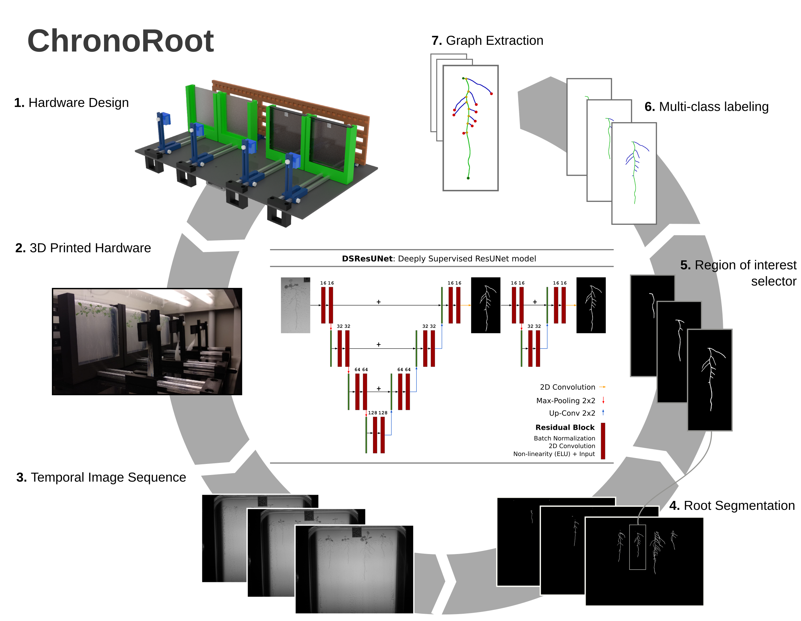

# ChronoRoot: High-throughput phenotyping by deep learning reveals novel temporal parameters of plant root system architecture

Nicolás Gaggion¹, Federico Ariel², Vladimir Daric³, Éric Lambert³, Simon Legendre³, Thomas Roulé³, Alejandra Camoirano², Diego Milone¹, Martin Crespi³, Thomas Blein³, Enzo Ferrante¹

¹ Research Institute for Signals, Systems and Computational Intelligence (sinc(i)), FICH-UNL, CONICET, Ciudad Universitaria UNL, Santa Fe, Argentina.\
² Instituto de Agrobiotecnología del Litoral (IAL), CONICET, FBCB, Universidad Nacional del Litoral, Colectora Ruta Nacional 168 km 0, Santa Fe, Argentina.\
³ Institute of Plant Sciences Paris-Saclay (IPS2), CNRS, INRA, University Paris-Saclay and University of Paris Bâtiment 630, 91192 Gif sur Yvette, France.

Video abstract:https://www.youtube.com/watch?v=3En7OyAwv_U

Pre-print available on: https://www.biorxiv.org/content/10.1101/2020.10.27.350553v1

Module controller available on: https://github.com/ThomasBlein/ChronoRootControl



### Installation:

First create the anaconda environment:
```
conda env create -f env.yml
```
Activate it with:
```
conda activate ChronoRoot
```
Then install the following packages via pip:
```
pip install tensorflow-gpu==1.15
pip install opencv-python
pip install git+https://github.com/lucasb-eyer/pydensecrf.git
```
In case of not having a GPU, use this line instead of the first one: 
```
pip install tensorflow==1.15 
```

### Usage:

Download the weights on ChronoRoot/modelWeights from:\
https://drive.google.com/file/d/17g7vPcTo6bF1iCf5zrj8iZTK6q48lyRm/view?usp=sharing 

or run this line:

```
python downloadWeights.py
```

For fast segmentation with the **Deeply Supervised Residual U-Net** use
```
python segmentFast.py imagePath --output_dir optionalSegPath --use_crf boolean --model ResUNetDS
```
For segmentation using the model ensemble use
```
python segmentEnsemble.py imagePath --output_dir optionalSegPath --use_crf boolean
```
For individual plant analysis, load the experiment data on config.conf and then run:
```
python chronoRoot.py
```
